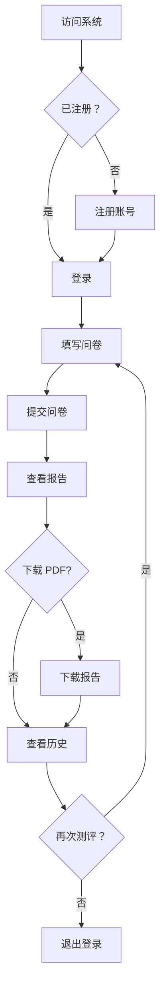
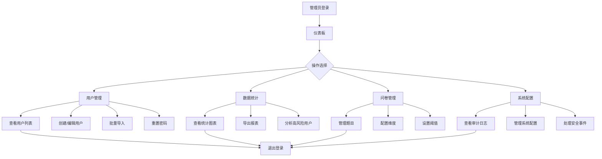

# 项目功能说明文档

**项目名称**: 基于大模型的大学生反诈风险多模态智能评估平台  
**版本**: v3.0  
**最后更新**: 2026-03-25  

---

## 📋 目录

1. [项目概述](#项目概述)
2. [系统架构](#系统架构)
3. [用户端功能](#用户端功能)
4. [管理端功能](#管理端功能)
5. [核心服务模块](#核心服务模块)
6. [API 接口说明](#api 接口说明)
7. [使用流程](#使用流程)

---

## 项目概述

### 项目背景

随着电信网络诈骗案件频发，大学生群体成为诈骗分子的主要目标。本项目基于大模型技术，构建了一个多模态智能评估平台，用于评估大学生的反诈风险认知水平，并提供针对性的安全教育。

### 核心目标

- 🎯 **风险评估**: 评估大学生的反诈风险认知水平
- 📊 **数据分析**: 提供多维度的风险评估报告
- 🎓 **教育支持**: 为高校安全教育提供数据支持
- 🔒 **隐私保护**: 保护学生隐私，确保数据安全

### 主要特点

- ✅ 基于 Flask 的 MVC 架构，模块化设计
- ✅ 集成通义千问大模型进行智能分析
- ✅ 支持多模态数据评估（认知、行为、经历）
- ✅ 完善的安全机制（CSRF 保护、密码加密）
- ✅ 响应式设计，支持多终端访问

### 适用场景

- 🏫 高校安全教育与风险评估
- 👨‍🎓 学生自我测评与学习
- 📈 教育部门数据统计与分析
- 🔍 反诈宣传效果评估

---

## 系统架构

### 技术架构图

```
┌─────────────────────────────────────────────────┐
│                 用户界面层                        │
│  ┌──────────┐  ┌──────────┐  ┌──────────┐      │
│  │  学生端  │  │  教师端  │  │ 管理员端 │      │
│  └──────────┘  └──────────┘  └──────────┘      │
└─────────────────────────────────────────────────┘
                     ↓
┌─────────────────────────────────────────────────┐
│                 应用服务层                        │
│  ┌─────────────────────────────────────────┐    │
│  │   认证服务 | 问卷服务 | 报告服务        │    │
│  │   用户管理 | 数据分析 | URL 检测         │    │
│  └─────────────────────────────────────────┘    │
└─────────────────────────────────────────────────┘
                     ↓
┌─────────────────────────────────────────────────┐
│                 业务逻辑层                        │
│  ┌──────┐ ┌──────┐ ┌──────┐ ┌──────┐          │
│  │ AI   │ │评估  │ │邮件  │ │导出  │          │
│  │分析  │ │服务  │ │服务  │ │服务  │          │
│  └──────┘ └──────┘ └──────┘ └──────┘          │
└─────────────────────────────────────────────────┘
                     ↓
┌─────────────────────────────────────────────────┐
│                 数据访问层                        │
│  ┌──────────┐  ┌──────────┐  ┌──────────┐      │
│  │  用户表  │  │ 提交表   │  │ 问卷表   │      │
│  └──────────┘  └──────────┘  └──────────┘      │
└─────────────────────────────────────────────────┘
```

### 模块关系图

```
主应用 (app/__init__.py)
    ↓
注册蓝图:
├── auth_bp (认证模块)
│   ├── 登录
│   ├── 注册
│   └── 登出
├── questionnaire_bp (问卷模块)
│   ├── 填写问卷
│   └── 查看历史
├── report_bp (报告模块)
│   ├── 查看报告
│   └── 下载 PDF
├── admin_bp (管理员模块)
│   ├── 仪表板
│   ├── 用户管理
│   ├── 问卷管理
│   └── 系统配置
└── audit_bp (审计模块)
    └── 日志查看
```

---

## 用户端功能

### 1. 用户注册与登录

#### 学生自助注册
**功能描述**: 学生可以通过学号和邮箱自行注册账号

**使用条件**: 
- 有效的学号
- 有效的邮箱地址
- 符合要求的密码（至少 6 位）

**操作流程**:
1. 访问注册页面 `/auth/register`
2. 填写学号、姓名、邮箱、密码
3. 系统验证学号唯一性和邮箱格式
4. 注册成功，自动跳转到登录页

**注意事项**:
- 学号必须唯一，不能重复注册
- 邮箱用于接收风险预警通知
- 首次登录建议修改初始密码

#### 用户登录
**功能描述**: 已注册用户通过学号和密码登录系统

**支持的登录方式**:
- 学号 + 密码（所有用户）
- 记住登录状态（可选）

**角色类型**:
- **student** - 学生用户（默认）
- **teacher** - 教师用户
- **admin** - 管理员用户

**安全特性**:
- CSRF 保护
- 密码加密传输
- 会话超时机制（1 小时）
- 登录失败次数限制

---

### 2. 风险评估问卷

#### 在线填写问卷
**功能描述**: 学生在线完成反诈风险评估问卷

**问卷结构**:
```
问卷包含三个维度：
├── 认知维度 (40 分) - 反诈知识掌握程度
│   ├── 诈骗类型识别
│   ├── 防骗知识了解
│   └── 法律法规认知
│
├── 行为维度 (30 分) - 日常行为习惯
│   ├── 个人信息保护
│   ├── 陌生来电处理
│   └── 转账汇款行为
│
└── 经历维度 (30 分) - 受骗经历分析
    ├── 过往受骗经历
    ├── 身边人受骗情况
    └── 风险意识自评
```

**题目类型**:
- 单选题：选择一个答案
- 多选题：选择多个答案
- 量表题：Likert 5 点量表

**功能特性**:
- ✅ 实时进度保存
- ✅ 题目导航（可跳回修改）
- ✅ 必答题验证
- ✅ 自动计算分数

**访问路径**: `/questionnaire/`

---

#### 开放文本题
**功能描述**: 提供文本输入框，收集学生的详细描述

**用途**:
- 描述具体的受骗经历
- 记录可疑的诈骗信息
- 提出反诈建议和问题

**字数限制**: 最多 1000 字

---

#### 图片上传
**功能描述**: 支持上传诈骗相关截图作为证据

**支持格式**: JPG, PNG, GIF

**文件大小**: 最大 16MB

**用途**:
- 上传诈骗短信截图
- 上传可疑聊天记录
- 上传其他相关证据

---

#### URL 风险检测
**功能描述**: 自动检测开放文本中提到的 URL 安全性

**检测流程**:
```
用户提交问卷
    ↓
提取文本中的 URL
    ↓
VirusTotal API 检测
    ↓ (如果失败)
腾讯 API 检测
    ↓ (如果失败)
AI 大模型分析
    ↓
返回风险评分
```

**风险等级**:
- ✅ 安全 - 未发现风险
- ⚠️ 可疑 - 存在风险特征
- ❌ 危险 - 确认为恶意链接

**影响**: 发现风险 URL 会增加最终风险评分

---

### 3. 评估报告查看

#### 个人风险评估报告
**功能描述**: 问卷提交后自动生成详细的评估报告

**报告内容**:

**1. 总体评分**
- 总分（0-200+）
- 风险等级标识
- 与常模对比

**2. 维度分析**
- 认知维度得分及占比
- 行为维度得分及占比
- 经历维度得分及占比
- 雷达图可视化

**3. AI 智能分析**
- 个性化分析报告
- 风险因素解读
- 薄弱环节识别

**4. 改进建议**
- 针对性学习建议
- 推荐学习内容
- 行为改善指导

**5. 历史记录**
- 历次测试分数对比
- 风险变化趋势图
- 进步情况统计

**访问路径**: `/report/` 或提交后自动跳转

---

#### 报告下载
**功能描述**: 支持将评估报告导出为 PDF 文件

**PDF 报告包含**:
- 个人基本信息
- 详细评分结果
- AI 分析报告
- 改进建议
- 二维码（可选，用于验证真伪）

**文件格式**: PDF

**生成时间**: 约 3-5 秒

---

### 4. 历史记录查看

**功能描述**: 查看自己所有的问卷提交记录

**显示信息**:
- 提交时间
- 总分和各维度得分
- 风险等级
- 报告查看入口

**功能**:
- 按时间排序
- 查看每次的详细报告
- 对比历史成绩变化

**访问路径**: `/questionnaire/history`

---

### 5. 风险链接检测

**功能描述**: 独立的 URL 安全检测工具

**使用方法**:
1. 访问检测页面
2. 输入待检测的 URL
3. 点击"开始检测"
4. 查看检测结果和风险等级

**检测维度**:
- 域名信誉
- 网站内容分析
- 历史检测记录
- 用户举报情况

**访问路径**: `/url-check`

---

## 管理端功能

### 1. 管理员仪表板

**功能描述**: 展示系统整体运行情况和关键指标

**核心数据**:

**统计概览**:
- 📊 总提交数：所有用户提交的问卷总数
- 👥 学生总数：注册的学生用户数
- ⚠️ 高风险人数：风险等级为"高"和"极高"的人数
- 📝 未处理事件：需要处理的安全事件数量

**高风险用户 TOP10**:
- 学号、姓名
- 平均风险分数
- 提交次数
- 最高风险等级

**数据筛选**:
- 按风险等级筛选
- 按时间范围筛选
- 按学号/姓名搜索
- 自定义排序规则

**分页设置**:
- 每页显示条数：10/20/50/100
- 支持翻页和跳转

**访问路径**: `/admin/`

---

### 2. 用户管理

#### 用户列表查看
**功能描述**: 查看所有注册用户信息

**显示字段**:
- 学号
- 姓名
- 邮箱
- 角色（学生/教师/管理员）
- 注册时间
- 最后登录时间
- 账号状态（启用/禁用）

**筛选功能**:
- 按角色筛选
- 按风险等级筛选
- 按关键词搜索（学号/姓名）

**分页**: 支持自定义每页条数

**访问路径**: `/admin/users`

---

#### 创建用户
**功能描述**: 手动创建新用户

**必填信息**:
- 学号（必须唯一）
- 密码
- 角色

**选填信息**:
- 姓名
- 邮箱

**操作**:
1. 点击"创建用户"按钮
2. 填写用户信息表单
3. 点击"确认创建"
4. 系统验证学号唯一性
5. 创建成功，显示在用户列表中

---

#### 编辑用户
**功能描述**: 修改已有用户的信息

**可修改字段**:
- 姓名
- 邮箱
- 角色
- 账号状态（启用/禁用）
- 密码（重置）

**不可修改字段**:
- 学号（创建后不可更改）

**操作**:
1. 在用户列表中找到目标用户
2. 点击"编辑"按钮
3. 修改相应字段
4. 点击"保存修改"

---

#### 删除用户
**功能描述**: 从系统中删除用户

**删除限制**:
- 当前登录用户不能删除自己
- 有提交记录的用户会提示确认

**操作步骤**:
1. 找到目标用户
2. 点击"删除"按钮
3. 二次确认
4. 删除成功

**注意**: 删除用户会同时删除其所有提交记录

---

#### 批量导入用户
**功能描述**: 从 Excel/CSV 文件批量导入用户

**支持格式**:
- Excel (.xlsx)
- CSV (.csv)

**文件模板**:
```
学号，姓名，邮箱，角色，密码
20260001，张三，zhangsan@example.com,student,password123
20260002，李四，lisi@example.com,teacher,password123
```

**导入流程**:
1. 准备导入文件
2. 点击"批量导入"按钮
3. 上传文件
4. 预览导入数据
5. 确认导入
6. 显示导入结果（成功/失败条数）

**错误处理**:
- 学号重复：跳过该行
- 格式错误：提示具体错误信息
- 继续导入其他行

**访问路径**: `/admin/users/import`

---

#### 密码管理
**功能描述**: 重置用户密码

**重置方式**:
1. **固定密码重置**: 统一重置为 `12345678`
2. **随机密码生成**: 系统生成 8 位随机密码

**邮件通知**:
- 重置成功后发送邮件通知
- 邮件包含新密码和登录链接
- 建议用户登录后立即修改

**操作步骤**:
1. 找到目标用户
2. 点击"重置密码"按钮
3. 选择重置方式
4. 确认重置
5. 发送通知邮件（可选）

---

### 3. 数据统计与分析

#### 整体统计
**功能描述**: 查看系统整体统计数据

**统计维度**:

**时间维度**:
- 今日数据
- 本周数据
- 本月数据
- 自定义时间段

**统计指标**:
- 新增用户数
- 问卷提交数
- 平均风险分数
- 高风险用户占比
- 活跃用户数

**可视化图表**:
- 折线图：趋势变化
- 饼图：占比分布
- 柱状图：对比分析

---

#### 用户分析
**功能描述**: 对用户群体进行深入分析

**分析维度**:

**风险分布**:
- 低风险人数及占比
- 中风险人数及占比
- 高风险人数及占比
- 极高风险人数及占比

**年级/专业分析** (如有数据):
- 各年级平均分对比
- 各专业风险分布
- 不同群体特征分析

**行为分析**:
- 提交频率统计
- 活跃时间段分析
- 功能使用热度

---

#### 导出报表
**功能描述**: 导出统计数据为 Excel 文件

**可导出内容**:
- 所有用户提交记录
- 高风险用户名单
- 统计分析报表
- 自定义筛选结果

**导出格式**: Excel (.xlsx)

**包含字段**:
- 基本信息（学号、姓名等）
- 各维度得分
- 风险等级
- 提交时间
- AI 分析结果

**操作**:
1. 设置筛选条件
2. 点击"导出数据"按钮
3. 选择导出范围
4. 下载 Excel 文件

---

### 4. 问卷管理

#### 题目管理
**功能描述**: 管理问卷中的所有题目

**题目属性**:
- 题目编号
- 题目内容
- 题目类型（单选/多选/量表）
- 所属维度（认知/行为/经历）
- 选项列表
- 分值配置
- 权重设置
- 是否启用

**操作功能**:
- ➕ 添加新题目
- ✏️ 编辑现有题目
- 🗑️ 删除题目
- 📋 批量导入题目
- 🔄 调整题目顺序
- ⏸️ 启用/禁用题目

**访问路径**: `/admin/questionnaire/questions`

---

#### 维度配置
**功能描述**: 配置三个维度的题目数量和分值

**配置项**:
- 认知维度题目数
- 行为维度题目数
- 经历维度题目数
- 各维度满分值
- 权重分配

**默认配置**:
```
认知维度：40 分 (约 10-15 题)
行为维度：30 分 (约 8-12 题)
经历维度：30 分 (约 5-8 题)
```

---

#### 阈值配置
**功能描述**: 配置风险等级的划分阈值

**默认阈值**:
```
低风险：≤ 30 分
中风险：31-55 分
高风险：56-80 分
极高风险：> 80 分
```

**调整方法**:
1. 进入阈值配置页面
2. 修改各等级阈值
3. 保存配置
4. 新提交的问卷使用新阈值

**注意**: 历史数据不受影响

---

### 5. 系统配置

#### 评分规则版本管理
**功能描述**: 管理评分规则的不同版本

**版本信息**:
- 版本号
- 生效时间
- 创建者
- 变更说明
- 规则详情

**功能**:
- 创建新版本
- 查看历史版本
- 切换生效版本
- 对比版本差异

**应用场景**:
- 学期初更新问卷内容
- 根据数据分析优化评分标准
- 保留历史版本用于研究对比

---

#### 审计日志
**功能描述**: 查看系统操作日志

**日志类型**:
- 用户登录日志
- 数据修改日志
- 系统配置变更日志
- 异常操作日志

**查询功能**:
- 按时间范围查询
- 按操作类型查询
- 按操作人员查询
- 按关键词搜索

**日志详情**:
- 操作时间
- 操作人员
- 操作类型
- 操作内容
- IP 地址
- 操作结果

**访问路径**: `/admin/audit-logs`

---

#### 安全事件管理
**功能描述**: 处理和跟踪安全事件

**事件来源**:
- URL 检测发现的高风险链接
- 用户举报的可疑信息
- 系统自动识别的异常行为

**处理流程**:
1. 事件登记
2. 初步审核
3. 分类定级
4. 分配处理
5. 处理反馈
6. 归档总结

**事件状态**:
- 待处理
- 处理中
- 已处理
- 已忽略

---

### 6. 反诈资源管理

**功能描述**: 管理反诈教育资源和推送内容

**资源类型**:
- 📖 反诈知识库文章
- 🎬 警示教育视频
- 📊 典型案例汇编
- 📱 宣传材料下载
- 🔗 官方资源链接

**推送内容配置**:
- 根据不同风险等级推送不同内容
- 配置推送内容的优先级
- 设置推送触发条件

**访问路径**: `/admin/resources`

---

## 核心服务模块

### 1. AI 分析服务 (AIAnalysisService)

**功能**: 使用通义千问大模型进行智能分析

**主要方法**:
```python
analyze_assessment(assessment_data)
    # 对评估数据进行 AI 分析
    # 输入：各维度分数、答案详情
    # 输出：分析报告、风险点识别
    
_build_prompt(assessment_data)
    # 构建 AI 提示词
    # 根据评估数据生成专业的分析请求
    
_parse_model_response(model_output)
    # 解析 AI 模型响应
    # 提取关键信息和建议
    
_get_rule_based_result(assessment_data)
    # 基于规则的备用分析方案
    # AI 不可用时使用此方法
```

**应用场景**:
- 生成个性化评估报告
- 识别潜在风险因素
- 提供针对性建议
- 智能问答交互

---

### 2. 评估服务 (AssessmentService)

**功能**: 问卷评估的核心业务逻辑

**主要方法**:
```python
calculate_scores(answers)
    # 根据答案计算各维度分数
    # 输入：答案字典
    # 输出：{cognitive, behavior, experience, base_score}
    
determine_risk_level(score)
    # 根据分数确定风险等级
    # 输入：总分
    # 输出：'低风险'/'中风险'/'高风险'/'极高风险'
    
process_questionnaire_submission(...)
    # 处理问卷提交完整流程
    # 包括：计算分数、判定等级、AI 分析、保存记录
```

**核心算法**:
- 认知维度：正向计分
- 行为维度：反向计分（分数越高风险越大）
- 经历维度：直接计分
- URL 风险加分：额外累加

---

### 3. URL 安全检测服务 (URLSecurityService)

**功能**: 检测 URL 的安全性

**降级策略**:
```
1. VirusTotal API (最准确)
   ↓ 失败
2. 腾讯安全 API
   ↓ 失败  
3. AI 大模型分析 (兜底方案)
```

**主要方法**:
```python
check_url(url, open_text="", use_ai_fallback=True)
    # 综合检测 URL（降级策略）
    # 返回：{is_risk, risk_level, risk_score, message}
    
extract_urls_from_text(text)
    # 从文本中提取 URL
    # 正则表达式匹配
    
check_url_virustotal(url)
    # VirusTotal API 检测
    
check_url_tencent(url)
    # 腾讯安全 API 检测
    
check_url_ai(url, open_text)
    # AI 大模型分析
```

**风险评分规则**:
- 恶意引擎数 ≥ 5: 高风险 (+20 分)
- 可疑引擎数 ≥ 3: 中风险 (+10 分)
- AI 判断可疑：低风险 (+5 分)

---

### 4. 邮件服务 (EmailService)

**功能**: 发送各类通知邮件

**邮件类型**:
```python
send_welcome_email(user_email, user_name, student_id)
    # 欢迎邮件（注册成功）
    
send_risk_warning_email(user_email, user_name, risk_level, total_score)
    # 风险预警邮件（高风险/极高风险）
    
send_password_reset_email(user_email, user_name, new_password)
    # 密码重置通知
```

**QQ 邮箱配置**:
```env
MAIL_SERVER=smtp.qq.com
MAIL_PORT=465
MAIL_USE_SSL=True
MAIL_USE_TLS=False
MAIL_USERNAME=your-qq-email@qq.com
MAIL_PASSWORD=your-smtp-auth-code
```

**发送策略**:
- 异步发送（不阻塞主线程）
- 失败重试机制
- 发送日志记录

---

### 5. PDF 生成服务 (PDFService)

**功能**: 生成评估报告 PDF 文件

**PDF 内容**:
- 封面（标题、个人信息）
- 总体评分
- 维度分析（含图表）
- AI 智能分析
- 改进建议
- 封底（二维码、联系方式）

**技术栈**:
- ReportLab (Python PDF 库)
- 中文字体支持
- 表格和图表绘制

**主要方法**:
```python
generate_pdf(submission, user)
    # 生成完整的 PDF 报告
    # 返回：PDF 文件字节流
    
_add_cover_page(...)
    # 添加封面
    
_add_score_section(...)
    # 添加评分部分
    
_add_analysis_section(...)
    # 添加分析部分
```

---

### 6. 数据导出服务 (ExportService)

**功能**: 导出数据为 Excel 格式

**支持导出**:
- 用户提交记录
- 高风险用户名单
- 统计分析报表
- 自定义查询结果

**Excel 格式**:
- 多工作表支持
- 表头样式美化
- 数据格式化处理
- 自动列宽调整

**主要方法**:
```python
export_submissions_to_excel(submissions, filename)
    # 导出提交记录到 Excel
    
export_high_risk_users_to_excel(user_ids, filename)
    # 导出高风险用户列表
    
create_summary_sheet(workbook)
    # 创建统计摘要工作表
```

---

### 7. 批量导入服务 (BatchImportService)

**功能**: 从文件批量导入用户

**支持格式**:
- Excel (.xlsx)
- CSV (.csv)

**导入流程**:
```python
import_users_from_file(file_path, default_password=None)
    # 从文件导入用户
    
    # 1. 读取文件
    # 2. 逐行解析
    # 3. 验证数据格式
    # 4. 检查学号唯一性
    # 5. 创建用户
    # 6. 返回导入结果
```

**错误处理**:
- 格式错误：记录错误行和原因
- 学号重复：跳过并记录
- 继续处理其他行
- 最后汇总报告

---

### 8. 审计服务 (AuditService)

**功能**: 记录和查询系统操作日志

**日志类型**:
- 用户登录/登出
- 数据增删改
- 系统配置变更
- 异常操作

**主要方法**:
```python
log_action(action_type, description, user_id=None, details=None)
    # 记录操作日志
    
get_user_logs(user_id, start_date, end_date, action_type=None)
    # 获取用户操作日志
    
get_system_logs(start_date, end_date, log_type=None)
    # 获取系统日志
```

**日志字段**:
- 操作时间
- 操作类型
- 操作人员
- 操作描述
- 详细信息（JSON）
- IP 地址

---

## API 接口说明

### 认证相关 API

#### 1. 用户登录
```http
POST /auth/login
Content-Type: application/x-www-form-urlencoded

参数:
student_id: string    # 学号
password: string      # 密码
remember: boolean     # 是否记住（可选）

响应:
成功：302 重定向到首页
失败：200 渲染登录页（带错误提示）
```

#### 2. 用户注册
```http
POST /auth/register
Content-Type: application/x-www-form-urlencoded

参数:
student_id: string    # 学号（必填）
name: string          # 姓名（必填）
email: string         # 邮箱（必填）
password: string      # 密码（必填，至少 6 位）
confirm_password: string  # 确认密码（必填）

响应:
成功：200 注册成功提示
失败：200 渲染注册页（带错误提示）
```

#### 3. 用户登出
```http
GET /auth/logout
Headers:
Cookie: session=xxx

响应:
302 重定向到登录页
```

---

### 问卷相关 API

#### 4. 获取问卷
```http
GET /questionnaire/

响应:
200 HTML 页面
包含：
- 所有启用的题目
- 题目类型和选项
- 分值配置
```

#### 5. 提交问卷
```http
POST /questionnaire/submit
Content-Type: multipart/form-data

参数:
answers: object       # 答案对象
open_texts: array     # 开放文本回答
images: file[]        # 上传的图片

响应:
成功：302 重定向到报告页
失败：400 错误提示
```

#### 6. 查看历史
```http
GET /questionnaire/history?page=1&per_page=10

响应:
200 HTML 页面
包含：
- 提交记录列表
- 分页信息
- 筛选选项
```

---

### 报告相关 API

#### 7. 查看报告
```http
GET /report/submission/<id>

参数:
id: integer    # 提交记录 ID

响应:
200 HTML 页面
包含：
- 详细评分
- AI 分析结果
- 改进建议
- 历史对比
```

#### 8. 下载 PDF
```http
GET /report/download/<id>

参数:
id: integer    # 提交记录 ID

响应:
200 PDF 文件
Content-Type: application/pdf
Content-Disposition: attachment; filename="report_<id>.pdf"
```

---

### 管理员 API

#### 9. 仪表板数据
```http
GET /admin/?risk_level=all&sort=submitted_at&order=desc&page=1

参数:
risk_level: string     # 风险等级筛选
sort: string          # 排序字段
order: string         # 排序方向
page: integer         # 页码
per_page: integer     # 每页条数

响应:
200 HTML 页面
包含：
- 统计数据
- 提交列表
- 高风险用户 TOP10
```

#### 10. 用户管理
```http
GET /admin/users?role=all&risk=&search=&page=1

参数:
role: string          # 角色筛选
risk: string          # 风险等级筛选
search: string        # 搜索关键词
page: integer         # 页码

响应:
200 HTML 页面（用户列表）
```

#### 11. 创建用户
```http
POST /admin/users/create
Content-Type: application/x-www-form-urlencoded

参数:
student_id: string    # 学号
name: string          # 姓名
email: string         # 邮箱
role: string          # 角色
password: string      # 密码

响应:
成功：302 重定向到用户列表
失败：200 渲染创建页面（带错误提示）
```

#### 12. 批量导入
```http
POST /admin/users/import
Content-Type: multipart/form-data

参数:
file: file            # Excel/CSV 文件
default_password: string  # 默认密码（可选）

响应:
200 HTML 页面
包含：
- 导入结果
- 成功/失败统计
- 错误详情
```

---

### 数据导出 API

#### 13. 导出数据
```http
POST /admin/export
Content-Type: application/x-www-form-urlencoded

参数:
export_type: string   # 导出类型
                      # submissions: 提交记录
                      # high_risk: 高风险用户
                      # statistics: 统计数据
filters: object       # 筛选条件
format: string        # 导出格式（xlsx）

响应:
200 Excel 文件
Content-Type: application/vnd.openxmlformats-officedocument.spreadsheetml.sheet
```

---

### URL 检测 API

#### 14. 检测 URL
```http
POST /api/check-url
Content-Type: application/json

参数:
{
    "url": "https://example.com"
}

响应:
{
    "success": true,
    "is_risk": false,
    "risk_level": "safe",
    "risk_score": 0,
    "message": "URL 安全",
    "source": "VirusTotal"
}
```

---

## 使用流程

### 学生用户完整流程



**步骤说明**:

1. **注册账号** (首次使用)
   - 访问 `/auth/register`
   - 填写学号、姓名、邮箱、密码
   - 等待审核（如需要）

2. **登录系统**
   - 访问 `/auth/login`
   - 输入学号和密码
   - 点击登录

3. **填写问卷**
   - 点击"风险评估"菜单
   - 认真阅读每一道题
   - 如实填写答案
   - 可上传相关截图
   - 检查无误后提交

4. **查看报告**
   - 提交后自动跳转
   - 查看详细评分
   - 阅读 AI 分析
   - 了解改进建议

5. **下载报告**
   - 点击"下载 PDF"按钮
   - 保存到本地
   - 可用于后续参考

6. **查看历史**
   - 点击"历史记录"菜单
   - 查看历次测评结果
   - 对比分数变化

7. **再次测评**
   - 建议每学期测评一次
   - 了解自身风险变化
   - 持续学习提高

---

### 管理员完整流程



**步骤说明**:

1. **登录管理员账号**
   - 学号：`88888888`
   - 密码：`admin123`

2. **查看仪表板**
   - 了解整体运行情况
   - 查看关键指标
   - 关注高风险用户

3. **用户管理**
   - 创建新用户
   - 编辑用户信息
   - 批量导入学生
   - 重置忘记密码

4. **数据统计**
   - 查看统计图表
   - 分析风险分布
   - 导出 Excel 报表
   - 识别重点人群

5. **问卷管理**
   - 添加/编辑题目
   - 调整维度配置
   - 更新评分阈值
   - 管理版本历史

6. **系统配置**
   - 查看操作日志
   - 处理安全事件
   - 管理反诈资源
   - 维护系统稳定

---

## 常见问题

### Q1: 忘记密码怎么办？

**A**: 联系管理员重置密码
1. 管理员在用户列表找到该用户
2. 点击"重置密码"
3. 选择重置方式（固定密码或随机密码）
4. 系统发送邮件通知新密码

---

### Q2: 可以多次填写问卷吗？

**A**: 可以，系统不限制填写次数
- 每次提交都会生成新的报告
- 可以在历史记录中查看所有记录
- 建议每学期填写一次

---

### Q3: 风险等级如何划分？

**A**: 根据总分划分：
- **低风险** (0-30 分): 反诈意识较强
- **中风险** (31-55 分): 有一定防范意识
- **高风险** (56-80 分): 防范意识薄弱
- **极高风险** (>80 分): 极易受骗，需重点关注

---

### Q4: AI 分析报告准确吗？

**A**: AI 分析基于通义千问大模型：
- 结合了您的答案详情
- 参考了专业知识库
- 提供了个性化建议
- 仅供参考，不代表专业心理评估

---

### Q5: 上传的图片会被看到吗？

**A**: 隐私保护措施：
- 仅管理员和您本人可见
- 用于分析和研究
- 定期清理过期数据
- 严格保密，不外泄

---

### Q6: 系统支持多少人同时使用？

**A**: 取决于部署环境：
- **开发环境**: 支持 10-50 人并发
- **生产环境** (Gunicorn + Nginx): 支持 500-1000 人并发
- **优化后** (Redis 缓存 + 数据库优化): 支持 2000+ 人并发

---

### Q7: 数据保存在哪里？

**A**: 
- **开发环境**: SQLite 数据库 (`instance/anti_fraud_dev.db`)
- **生产环境**: MySQL/PostgreSQL 数据库
- 所有敏感数据加密存储
- 定期备份防止丢失

---

### Q8: 如何获取技术支持？

**A**: 
1. 查看项目文档
2. 检查常见问题解答
3. 联系系统管理员
4. 提交问题反馈

---

## 附录

### 角色权限对照表

| 功能模块 | 学生 | 教师 | 管理员 |
|---------|------|------|--------|
| 填写问卷 | ✅ | ✅ | ✅ |
| 查看个人报告 | ✅ | ✅ | ✅ |
| 下载 PDF | ✅ | ✅ | ✅ |
| 查看历史 | ✅ | ✅ | ✅ |
| URL 检测 | ✅ | ✅ | ✅ |
| 用户管理 | ❌ | ❌ | ✅ |
| 数据统计 | ❌ | ✅ | ✅ |
| 问卷管理 | ❌ | ✅ | ✅ |
| 系统配置 | ❌ | ❌ | ✅ |
| 审计日志 | ❌ | ❌ | ✅ |

---

### 风险等级颜色标识

| 等级 | 颜色 | 标识 |
|------|------|------|
| 低风险 | 🟢 绿色 | 安全 |
| 中风险 | 🟡 黄色 | 注意 |
| 高风险 | 🟠 橙色 | 警告 |
| 极高风险 | 🔴 红色 | 危险 |

---

### 浏览器兼容性

| 浏览器 | 最低版本 | 推荐版本 |
|--------|---------|---------|
| Chrome | 80 | 最新版 |
| Firefox | 75 | 最新版 |
| Safari | 13 | 最新版 |
| Edge | 80 | 最新版 |
| IE | ❌ 不支持 | ❌ 不支持 |

---

**文档版本**: v1.0  
**维护者**: 脆心柚  
**最后更新**: 2026-03-25
